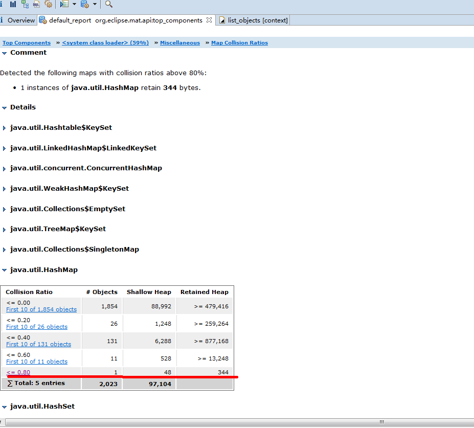

[TOC]

# 结构总览

记住下面名词的解释：

`Shallow Heap：代表当前对象占用的内存空间；`

`Retained Heap：代表当前对象被回收后所能释放的内存空间大小。`

一些操作：

`List objects -> with outgoing references ：列出包含哪些对象；`

`List objects -> with ingoing references ：列出被哪些对象包含；`

`第一行的Regex中都可以填写过滤表达式快速筛选自己想分析的类。`

# 1 Detail

这部分统计了当前堆已使用的总大小

`Size: 18.8 MB Classes: 8.3k Objects: 325.8k Class Loader: 119 Unreachable Objects Histogram`

总大小: 18.8M 类大小8.3kb 对象:325.8k 类加载器:119k

Unreachable Objects 代表根不可达的对象,即可以被回收的对象,如下图所示,可以发现最大的前几位对象是char[],String,byte[]和TRNameListHitRecord对象,这是由于压测时请求量太大,生成了大量的TRNameListHitRecord对象,在对象异步入库后被释放导致.

 

# 2 Biggest Objects by Retained Size

这部分代表目前应用中最大的几个对象的总大小,这部分的数据可以用来分析应用是否可能发生内存泄漏,留在后面Leak Suspects中介绍.

# 3 Actions

## 3.1 Histogram

应用中各个类所占用内存大小的直方图,倒序排列

可以看到NameList类一共有10078个，黑名单和白名单各5000个左右，占用了241872/1024/1024=0.23M，Retained heap大小为725624/1024/1024=0.69M，符合预期。

 

还可以在第一行的regex里填写条件，此时填写应用的包名，就可以过滤到目前应用中所有对象占用的内存大小，如下图，可以发现，没有什么问题，NameList是黑白名单的缓存信息，其他的数量都很少。

## 3.2 Dominator Tree

应用中各个对象占比,倒序排列，可以展开某条数据查看其内部具体包含哪些变量及变量的内存占比。第一行的Regex表达式同样可以根据自己的需要进行过滤。

可以发现系统中目前最大的对象为SynMap，它是存储黑白名单的对象，2162040/1024/1024=2.06M，符合预期。

## 3.3 Top Consumers

分析应用中资源消耗最高的对象（Biggest Object）、类（Biggest Top-Level Dominator Classes）、类加载器（Biggest Top-Level Dominator Class Loaders）及包（Biggest Top-Level Dominator Packages）。

除了包之外，上面三个统计都有一个饼图展示结合一个表格展示。比如展开对象的统计信息如下图所示，同Dominator Tree中统计信息相同。

## 3.4 Duplicate Classes

发现被不同类加载器重复加载的类，如下图所示，发现都是Lambda相关的，无应用中的类，符合预期。

# 4 Report

## 4.1 Leak Suspects

帮助分析应用内存泄漏的工具，结合了饼图与问题列表的形式展示分析结果，可以直接点击问题的Details跳转到具体的问题中进行分析。

本应用怀疑有三个地方有内存泄漏，第一个和第三个是类加载器及线程组

点击第二个problem 的detail 进行查看，可以看到问题详情页中包含五个部分：

1.Description（问题描述）

一个名为SynMap被WebAppClassLoader加载的对象共占用了2162040 bytes（占当前已使用内存的10%）。内存累积在<system class loader> 加载器加载的HashMap$Node实例中。

2.Shortest Paths To the Accumulation Point（问题对象到GC根节点的最短路径）

当前分析出来的问题对象HashMap是用来存储黑白名单缓存的对象，可以看到导GC根节点时经过了SynMap，最终被多个Thread使用。所以此处可以排除非应用中的内存泄漏。

 

3.Accumulated Objects in Dominator Tree（以当前问题对象为根的Dominator支配树）

此处列出了HashMap的支配树，可以发现它是被SynMap引用且包含了一个大小为16384的数组，点击下图红线的节点，从左边的Attributes中可以查看其具体的属性。

 

4.Accumulated Objects by Class in Dominator Tree（以当前问题对象为根的Dominator支配树按类的维度分类统计）

这里其实是将上面的支配树中的对象按类汇总了一下，查看相关类占用的内存大小。

5.All Accumulated Objects by Class（所有对象按类的维度统计占用内存分析）

这里不同上面的支配树中的类统计，是将所有该对象中使用到的类进行了汇总统计。发现Char[]占用了最大，其次是Date对象，这里我们只观察下大小即可。

 

## 4.2 Top Components

展示了大于1%内存的组件

 

没有发现跟应用相关的类，我们可以点击第一个进行查看具体的分析。

该详情页面有包含可能的内存浪费分析的，如下图显示有重复字符串分析、空集合分析及集合填充率分析等。本应用没有出现过度使用的空集合及大量低填充率的集合，但是发现有重复字符串的问题。

可以看到问题描述为找到了119个char[]实例，其中至少有10个实例具有相同的内容，总大小为2609832bytes。什么意思呢，就是重复出现最少十次的char[]共有119个，点击Detail进行查看具体重复字符串信息。

这里可以看到所有的重复char[]，如果想看具体的重复信息，选择Histogram中具体的字符串的链接查看。比如我们点击第二个字符串的链接查看，发现字符串中存储的都是我们接口的返回值信息。其他的重复字符串统计也基本是由于压测时大量创建对象造成，这里没什么我们应用内部的问题，可以继续分析其他指标。

（本节详细分析TODO）也有对象软弱引用及实现了finalize方法、map集合碰撞率等的分析。关于soft 和 weak 引用我们大致看一下就OK了，没什么问题就可以，详细的统计可以点击Detail查看。

软引用统计：这里有一共2874个软引用对象。共有21310个对象一共971.9kb被软引用保留在内存中。

弱引用统计：一共有8905个弱引用对象。共有90个对象一共4.2kb被弱引用保留在内存中。

Finalizer 统计：共有409个对象实现了finalize方法。

Map碰撞率分析：检测到一个HashMap对象的碰撞率超过了80%。点击Detail可以查看应用中各个集合的碰撞率，我们点开HashMap，如下图缺失发现了一个对象的碰撞率超过80%，这正是上述统计的那个占用了344byte的Map。

我们想看下这个Map里存储的是什么，点击表中<=0.8的蓝色链接。点击List objects -> with outgoing references可以查看当前的HashMap中存储的是什么。如下图所示，HashMap中存储的为一些TcpEndpoint的对象信息。

# 5 Heap Dump Overview

项目的具体统计信息还可以点击菜单栏的第六个图标,选择Heap Dump Overview进行查看

 

